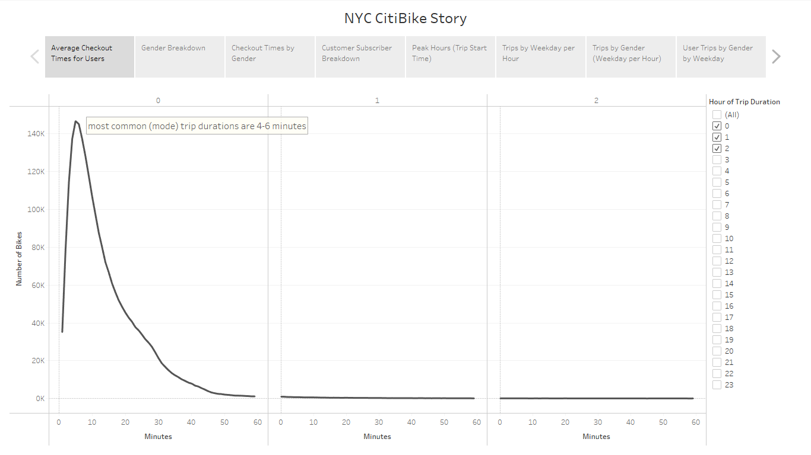
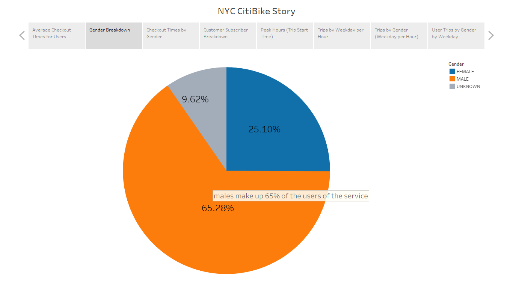
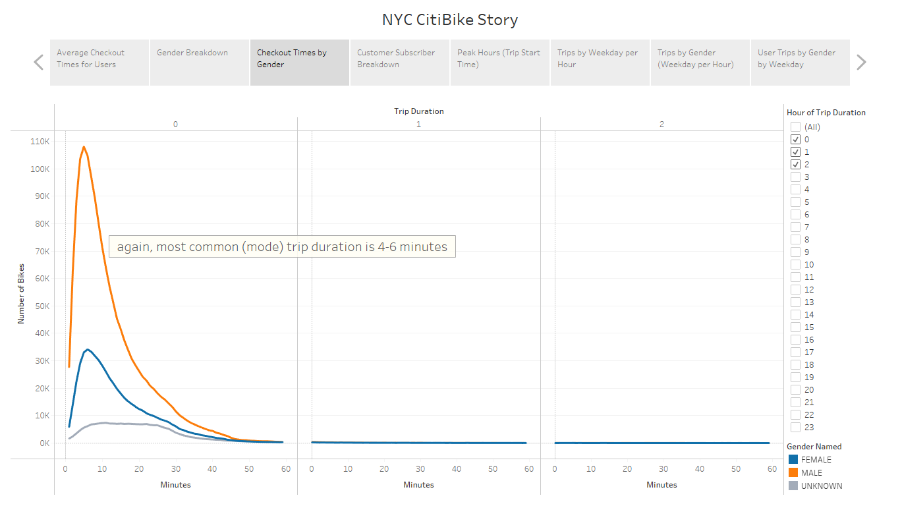
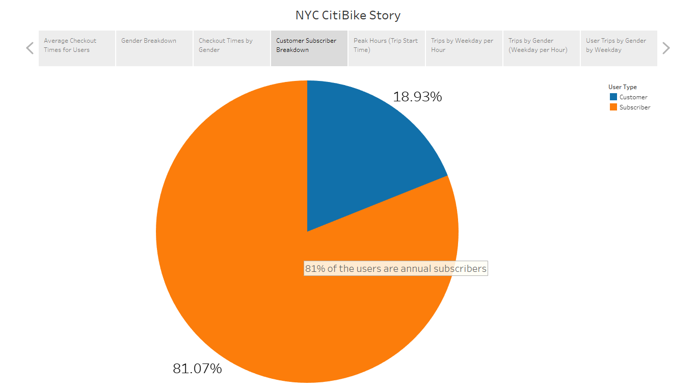
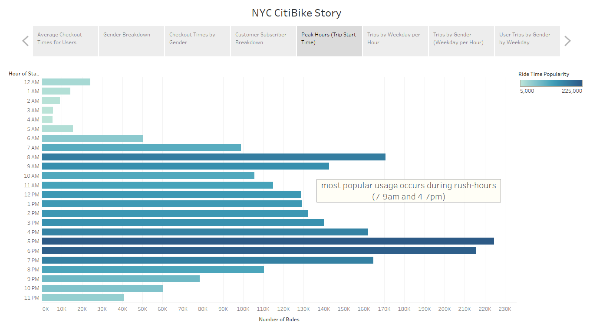
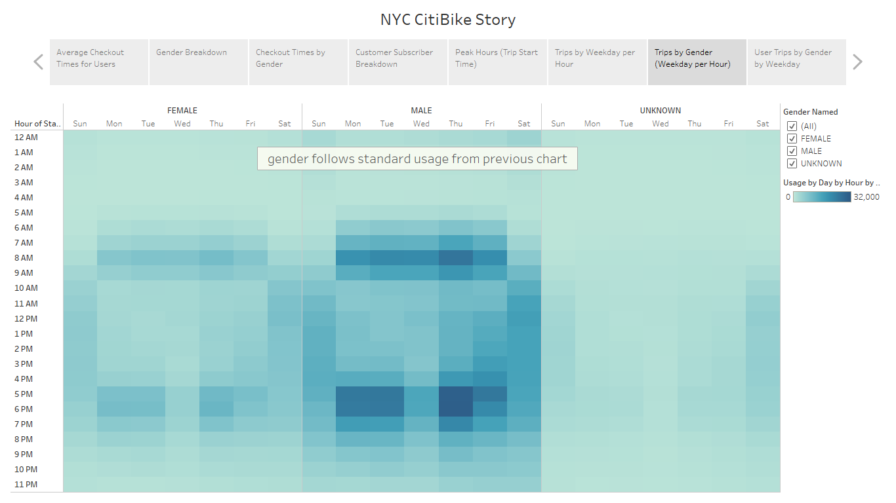
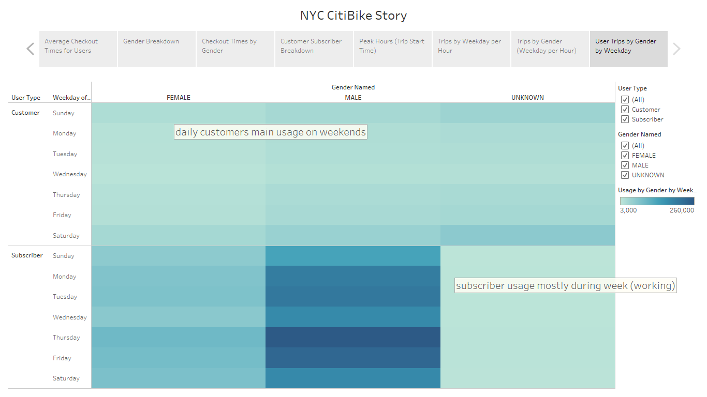

# NY CitiBike with Tableau

## Tableau Public

**You can see a live version of this analysis on Tableau Public: [Tableau Public link to Visualization/Story](#)**

## Challenge - Overview

Explain the purpose of this analysis.

## Challenge - Results

Using the visualizations you have in your Tableau Story, describe the results of each visualization underneath the image.

There are at least seven visualizations for the NYC Citibike analysis.
There is a description of the results for each visualization.

Using the 5 created in Deliverable 2 and 2 from the module create the Story and then use each point here.

## Challenge - Summary

Provide a high-level summary of the results and two additional visualizations that you would perform with the given dataset.
There is a high-level summary of the results and two additional visualizations are suggested for future analysis.

## Context

This is the result of Module 14 of the University of Toronto School of Continuing Studies Data Analysis Bootcamp Course - **Ny CitiBike with Tableau** - Analysing a NY CitiBike dataset with Tableau. Following the guidance of the module we end up pushing this selection of files to GitHub.
