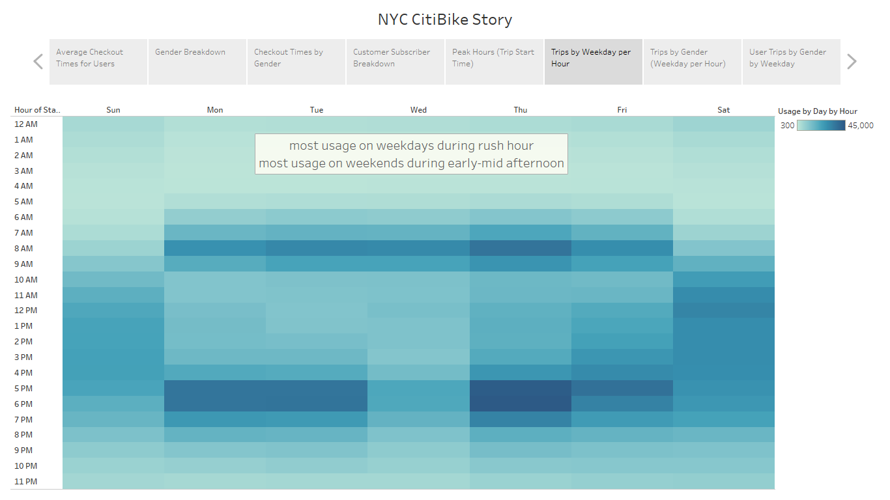

# NY CitiBike with Tableau

## Tableau Public

**You can see a live version of this analysis on Tableau Public: [Tableau Public link to Visualization/Story](https://public.tableau.com/profile/shaun.coulter#!/vizhome/Module14-NYCCitibike_16216171699220/NYCCitiBikeStory)**

## Challenge - Overview

For this module we were introduces to Tableau, an industry-leading data visualization application. We were supplied with a dataset of bicycle trips from the NYC service CitiBike - a bicycle sharing program based in New York. This dataset contained all the trips taken place in August 2019 and included a breakdown of the users and the trip lengths. We were tasked with analysing the data and presenting our findings using data visualizations built in Tableau.

The background behind the challenge is to determine whether this similar service could be deployed in Des Moines, Iowa. We would use our visualizations as well as some higher-level analysis to produce a Tableau story from the data and report our findings. We would also be required to suggest further analysis that should be undertaken should a company wish to supply this service.

We use a variety of visualizations in this module, including bar charts, pie charts and heatmaps. We also saved the story compiled from our worksheets to Tableau public, the link of which can be found above. A detailed discussion of our story follows in the results section.

## Challenge - Results

**Story Points**: These are our CitiBike data story points, organized by their graph names, they include the 5 challenge charts and 3 picked from the module to tell a story about the NYC CitiBike dataset from August 2019.

***Challenge Graph*** - **Average Checkout Times for Users**: The average (in this case, mode) length of a bike rental/trip duration is for a 4-6-minute journey. This would imply that in NYC there were an abundance of places to travel to that are nearby to each other - this includes workplaces and housing/apartments. In more spaced-out metropolitan areas, you could expect to see the trip duration increase until it became infeasible to use a bike rather than a car, i.e., more suburban areas. New York City is well known for its dense population and high traffic so short trips on a bike are plentiful.

***Module Graph*** - **Gender Breakdown Pie Chart**: Here we see a pie chart representing the gender breakdown of bike users. Around two thirds of the users are male, a quarter are female, and roughly nine percent are unknown. This shows the CitiBike service is mainly dominated by male users.

***Challenge Graph*** - **Checkout Times by Gender**: Here we see essentially the first two graphs combined. We see the same male dominance in bicycle usage, but also the same peak trip durations for both genders of 4-6-minutes - so, the length of the journeys is not gender dependent. The unknown gender category does not have such a defined peak, with the more popular trip durations anywhere between 8-30 minutes.

***Module Graph*** - **Customer/Subscriber Breakdown**: This graph shows the breakdown of user type, where subscriber refers to a user with an annual subscription to the service, and customers are those with 1-3-day passes to the service. Subscribers make up 80+% of CitiBike users, this would imply that most of the users are residents of NYC rather than tourists, as tourists have little need to purchase a year-long membership. Given this knowledge and the fact that most journeys are 4-6-minutes we can begin to see CitiBike is mostly being used for work commutes.

***Module Graph*** - **Peak Usage Hours (Using Trip Start Time)**: Following on from our previous hypothesis about CitiBike usage and work commuting we look to this chart that we produced during the module. Quite clearly, we can see that the peak usage times of the service are during so-called rush-hour timeslots: 7-9am and 5-7pm. This trend really solidifies the idea that most users of the service are annual subscribers that use the service for their commute to work.

***Challenge Graph*** - **Trips by Weekday per Hour**: Here we look at a heatmap style chart that separates the bike usage down by hour of the day, and by day of the week. The darker tones represent the higher usage, and we can see more proof that there is peak usage during rush-hour times on the weekdays, but more spread-out usage on the weekends. We would need to view this data by user type to see how if each type of user is following our hypothesized pattern. We also notice that Wednesday evening rush-hour is not as intense as the other weekdays *(more on this later)*.

***Challenge Graph*** - **Trips by Gender (Weekday per Hour)**: We dissect the heatmap further, first by looking at the data split by gender. We notice, like in the first few charts, that the gender makeup follows the combined data - there is no gender difference in the most popular usage times (rush hours and spread out on weekends). One interesting thing to note is that the unknown gender category does not seem to focus as heavily on the weekday rush-hours, but rather on the spread-out weekend usage. This shows that the majority of unknown-gender users are brief customers (1–3-day passes). This follows from the idea that users would be more comfortable handing over personal data about themselves (like gender) if they are subscribing for a year to a service.

***Challenge Graph*** - **User Type Trips by Gender by Weekday**: We mention above the need to split the heatmap by user type, and for the final chart of the assignment we do just that. The split by user type shows that the subscribers use the service more during weekdays, while the customers use it more on the weekends. We notice here that the unknown gender category falls mostly into customers rather than subscribers, this explains the differing behaviour we have seen in the gendered charts so far.

## Challenge - Summary

Following the story points above we are shown that the main users of the CitiBike service are male annual subscribers. However, it does not seem that there are gendered differences in the way the service is used. Both listed genders use the service during the same peak days and hours, likely for the same reasons. The unknown gender category uses the service differently than the average simply because they are more likely to be customers rather than subscribers, which is not the norm for the rest of the users. Customers using a service for a short period of time are less likely to give over personal data like gender when compared to subscribers of the service.

We also can see that as most bicycle usage is by subscribers during rush-hours, that most users are using the bikes to commute to work. As NYC is a densely populated area workplaces and homes (apartments) are highly likely to be near enough to warrant using a bike, but not walk. Later-day usage is much higher in general than any other hours of the day, but we see such a distinct spike during rush hours that we must make the connection between the service and commuting.

To further prove our hypothesis, we can look at **Trips by User Type (Weekday per Hour)** in Tableau, and add it to our story:

Here we can clearly see the usage of the service by the two different user types. Customers (1-3-day passes) are using the service mainly on weekends, they are either tourists in the city or residents that are briefly using the service for the same sort of travel. They have no need for an annual subscription and are only interested in using the service for a brief time during their free time. On the other side we have the subscribers who as we expected are mainly using the service during rush-hours on weekdays, for their commutes to-and-from work. They also show usage on the weekends, likely using the service for the same reasons as the customers, but it is not the main purpose of their subscription.

Earlier we mentioned the strange fact that the Wednesday evening rush-hour slot was less intense than the same timeframe on the other weekdays. To investigate why this is we can pull a line chart for the **Rides by Day** and include a **day of the week** filter.

We have also separated the data by user type as well, to see if that was the reason for the low turnout on the Wednesday. From this chart we can see that when subscriber usage decreases it is mirrored by customer increase - this would be the weekdays versus the weekends. We already know that subscriber usage is up during the week for work commutes, but we can also clearly see the difference in usage by customers on the weekends. There is a clear spike in the customer line on Saturday, and to a lesser extent Sunday, showing it is the most popular day for customer bicycle usage.

By focusing on Tuesday, we can see that bicycle usage is steady from week to week:

We can then compare that to comparing each **Wednesday** in August:

The above chart clearly shows a large dip on the first Wednesday, the 7th of August 2019. We can investigate this date that has an almost one-third decrease in customer usage by exploring the date online. We use Google and social media platforms to find out whether there was an event that day that caused road closures, or possible traffic issues, or even an issue with the bikes themselves (CitiBike could have had issues).

While it is impossible to fully state why this dip occurred here, this data analyst would point towards the weather being the main factor in people choosing not to use bikes as they normally would. After viewing Twitter and various weather websites to determine the weather on the 7th, we come across the following tweet:

As detailed in the above tweet it appears that New York City faced thunderstorms and rain on this date, particularly later into the day, explaining the drop-off of bicycle usage. We often must be careful not to attribute everything to the weather in data analysis but given August's normally good weather I think it is safe to say this change caused a large dip in the usage of the CitiBike service.

This shows that CitiBike needs to pay close attention to the weather in the city when dealing with their fleet of bicycles, and any company wanting to create a CitiBike-like service should be aware of it too. Due to later day weather the service could find its bicycles in the wrong areas for the next rush of service the following morning. They would have to ensure they can still provide the same level of service even with changing weather conditions.

Following on from this idea we could compare average starting and ending locations to make sure enough bikes are provided at the high-use locations, and that enough are removed from ending locations to make room for more. By having a plan in place for dealing with volume variation we can account for the weather, and any other occurrence that stops enough bicycles being in the right places. Any company wishing to emulate CitiBike would need to be aware of where their bikes need to be and when, in order to provide the best service to the customers.

## Context

This is the result of Module 14 of the University of Toronto School of Continuing Studies Data Analysis Bootcamp Course - **NY CitiBike with Tableau** - Analysing a NY CitiBike dataset with Tableau. Following the guidance of the module we end up pushing this selection of files to GitHub.
